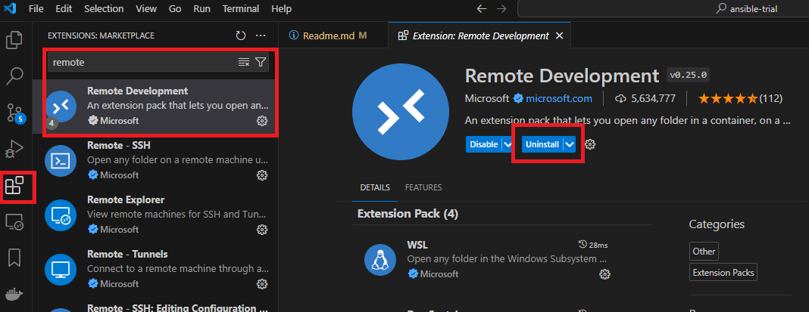
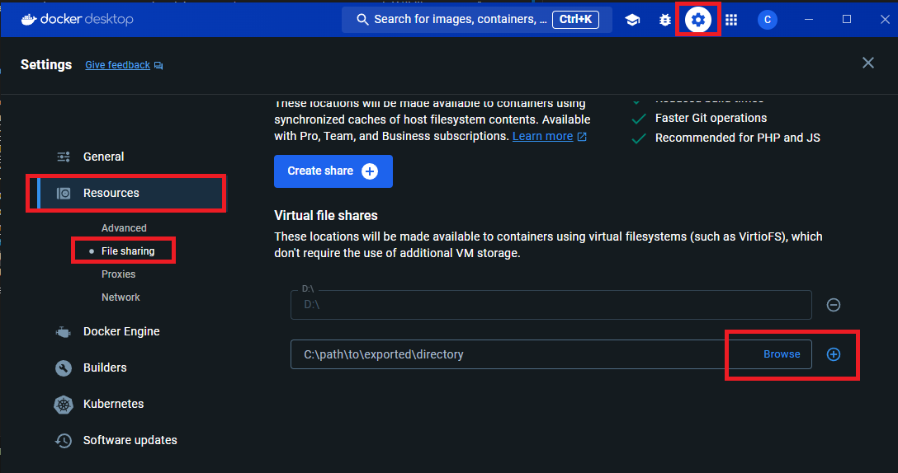
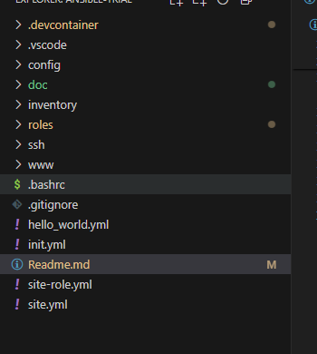
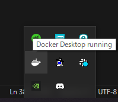
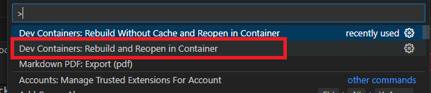
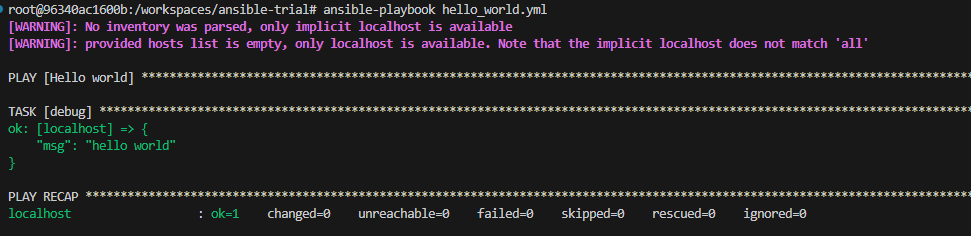

# リソースの説明

- config
    - ansible.cfg   ･･･ ansibleの設定ファイル
- inventory
    - hosts ･･･ 操作対象ホスト定義
    - group_vars ･･･ グループ変数（サンプル）
    - host_vars ･･･ ホスト変数（サンプル）
- roles
    - common ･･･ 共通の操作関連role（apacheのインストール）
    - app  ･･･ html操作関連role
- ssh
    - config    ･･･ SSHの設定ファイル(Shift JIS)
- wwww          ･･･ サンプルWebコンテンツ
    - site-a
    - site-b
- site-role.yml ･･･ role適用後のplaybook
- site.yml      ･･･ ゼロベースのplaybook

# 事前準備

AnsibleはローカルのDokcerコンテナで実行されますので、以下の手順に従って事前準備をしてください。<br/>


### Docker

1. [Docker](https://desktop.docker.com/win/main/amd64/Docker%20Desktop%20Installer.exe?utm_source=docker&utm_medium=webreferral&utm_campaign=dd-smartbutton&utm_location=module&_gl=1*1ju5xpl*_ga*MTQyMjM0NzE1MS4xNjcxMTU3MTY1*_ga_XJWPQMJYHQ*MTcxODAyOTM5MS4xOTEuMS4xNzE4MDI5NDAyLjQ5LjAuMA..){:target="_blank"}をDLし、インストールします<br/>
<b>インストール前のメモリの空きが2GB以上であること</b><br/>
<b>※Dockerを常用しない場合は、自動起動をオフにしておくことをおすすめします</b><br/>
すでにインストールしている場合は不要
1. [VSCode](https://code.visualstudio.com/){:target="_blank"}をDLし、インストールします
1. VSCodeの拡張機能「[Remote Development](https://marketplace.visualstudio.com/items?itemName=ms-vscode-remote.vscode-remote-extensionpack){:target="_blank"}」をインストールします<br/>
    
1. 当ソースのディレクトリをDockerの共有ドライブの設定に加える<br/>
    `c:\ansible-trial`に当ソースがあるのであれば、このパスを追加<br/>
    
1. sshフォルダに`ansible-trial.pem`を追加します
1. 当ソースのルートを基点にVSCodeを起動する<br/>
    ファイルエクスプローラーが以下のようになります<br/>
    
1. Docker Desktopが起動していることを確認します<br/>
    <br/>
1. 「Shift + Ctrl + P」で「Rebuild and Reopen in Container」でAnsibleコンテナを起動<br/>
    しばらくの間コンテナを作成しているので、お待ちください<br/>
    作成が完了すると左側にファイルエクスプローラーが表示されます<br/>
    <br/>
1. 「Ctrl + @」でターミナルを開き、以下のコマンドを実行し、「hello world」が出力されば完了です<br/>
    ```shell
    ansible-playbook hello_world.yml
    ```
    


以上
